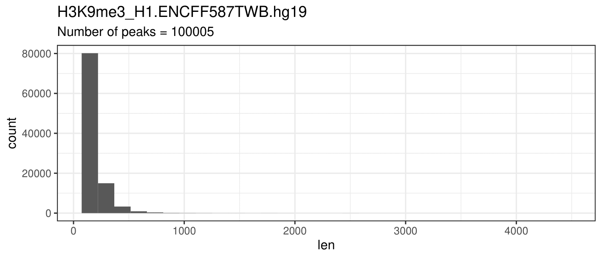

# Проект по майнору "Биоинформатика", ВШЭ 2021
## hse21_H3K9me3_G4_human
*Усенкова Мария, 3 группа*
### Исходные данные

| Организм | Структура ДНК | Гистоновая метка | Тип клеток | Метка 1 | Метка 2 |
| -------- | ------------- | ---------------- | ---------- | ------- | ------- |
| Human (hg19) | G4_seq_Li_K | H3K9me3 | H1 | [ENCFF587TWB](https://www.encodeproject.org/files/ENCFF046DTX/) | [ENCFF697NMG](https://www.encodeproject.org/files/ENCFF697NMG/) |

Сохраненная сессия в UCSC GenomeBrowser: http://genome.ucsc.edu/s/mausenkova/hse21_H3K9me3_G4_human

### Анализ пиков гистоновой метки
Для работы были скачаны на кластер архивы с .bed-файлами с данными. При распаковке архивов были оставлены только первые 5 столбцов данных:
```bash
wget https://www.encodeproject.org/files/ENCFF697NMG/@@download/ENCFF697NMG.bed.gz
wget https://www.encodeproject.org/files/ENCFF587TWB/@@download/ENCFF587TWB.bed.gz
zcat ENCFF587TWB.bed.gz | cut -f1-5>H3K9me3_H1.ENCFF587TWB.hg19.bed
zcat ENCFF697NMG.bed.gz | cut -f1-5>H3K9me3_H1.ENCFF697NMG.hg19.bed
```
*Так как изначально скачанные .bed файлы были версии hg19, утилиту liftover я не использовала.*

Полученные файлы с помощью программы WinSCP были перенесены на ПК для дальнейшей работы.
##### Построение гистограмм длин участков
С помощью [скрипта](src/len_hist.R) на R были получены гистограммы длин участков для каждого эксперимента. 
Результаты:


##### Фильтрация пиков
С помощью [скрипта](/src/filtered.R) на R были отфильтрованы пики длиной более 5000. 
Результаты:




##### Расположение пиков

С помощью [скрипта](src/ChipSeeker.R) на R были построены графики расположения пиков гистоновых меток относительно аннотированных генов. 
Результаты:

###### chip_seeker.ENCFF697NMG.hg19.filtered.plotAnnoPie

###### chip_seeker.ENCFF587TWB.hg19.filtered.plotAnnoPie


##### Объединение файлов

Отсортированные файлы были загружены на кластер, отсортированы и объединены с помощью bedtools:

```bash
 cat  *.filtered.bed  |   sort -k1,1 -k2,2n   |   bedtools merge   >  H3K9me3_H1.merge.hg19.bed
```

Затем с помощью winSCP полученный файл был перенесен на ПК для дальнейшей работы.


